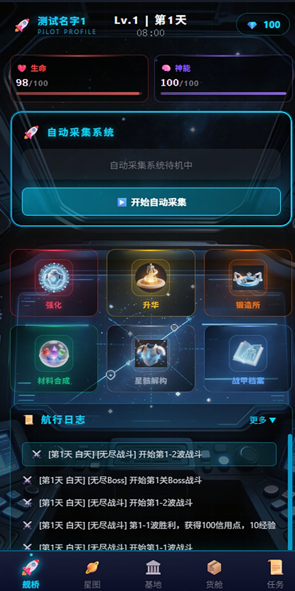
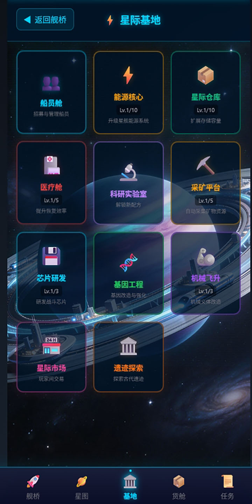
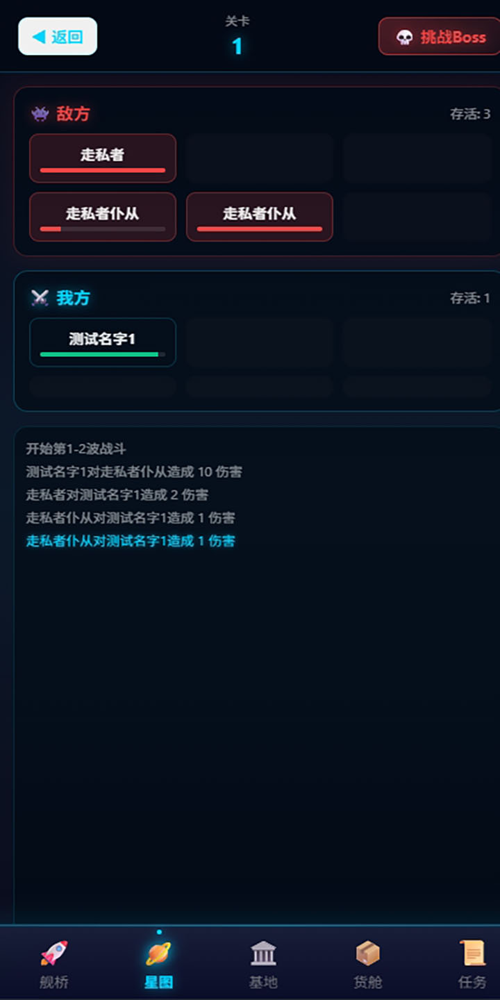
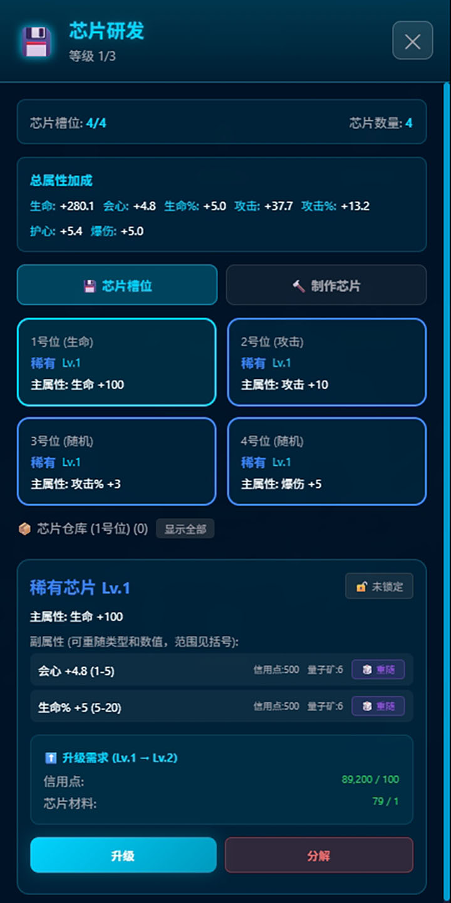
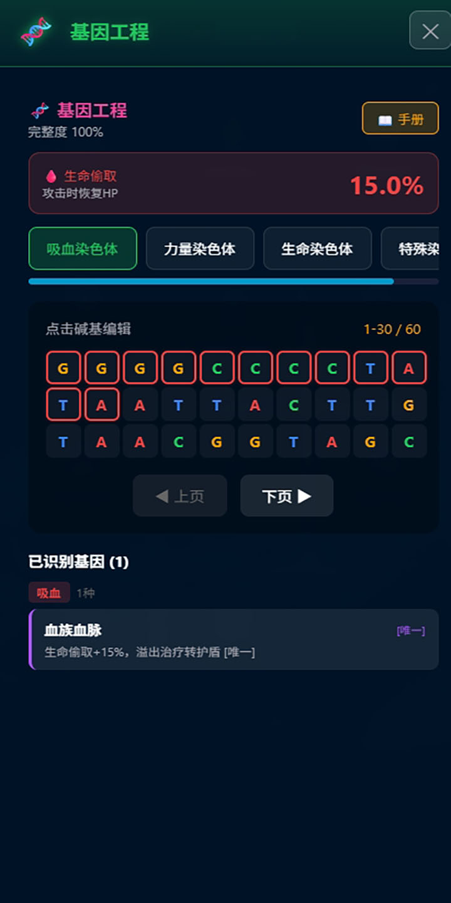

# 星航荒宇 (Xinghang Huangyu)

一款科幻题材的放置类RPG游戏，玩家在星际间穿梭，探索未知，收集资源，建设基地，招募船员，与敌人战斗。

## 游戏特色

- 🚀 **星际探索** - 驾驶星际航船穿梭于银河系各星球之间
- ⚔️ **策略战斗** - 6v6回合制战斗，配置船员阵容
- 🧬 **角色成长** - 基因改造、机械飞升、芯片系统
- 🏗️ **基地建设** - 12种可升级设施，解锁新功能
- 🎮 **跨平台** - 支持 Web、Android、iOS

## 技术栈

| 类别 | 技术 | 版本 |
|------|------|------|
| 前端框架 | React | 19.x |
| 编程语言 | TypeScript | 5.9.x |
| 构建工具 | Vite | 7.x |
| 状态管理 | Zustand | 5.x |
| 样式方案 | Tailwind CSS | 4.x |
| 跨平台 | Capacitor | 6.x |
| 测试框架 | Vitest | 4.x |
| 数据持久化 | LocalStorage | - |

## 快速开始

### 环境要求

- Node.js >= 18.0.0
- npm >= 9.0.0

### 安装与运行

```bash
# 克隆项目
git clone <repository-url>
cd trainsurvival-capacitor

# 安装依赖
npm install

# 启动开发服务器
npm run dev

# 访问 http://localhost:5173
```

### 其他命令

```bash
# 构建生产版本
npm run build

# 预览生产版本
npm run preview

# 运行测试
npm run test

# 运行测试并生成覆盖率报告
npm run test:coverage

# 代码检查
npm run lint
```

## 项目结构

```
trainsurvival-capacitor/
├── src/                           # 源代码目录
│   ├── core/                      # 核心游戏系统
│   │   ├── GameManager.ts         # 游戏管理器
│   │   ├── Player.ts              # 玩家系统
│   │   ├── Inventory.ts           # 背包系统
│   │   ├── ChipSystem.ts          # 芯片系统
│   │   ├── GeneSystem.ts          # 基因系统
│   │   ├── CyberneticSystem.ts    # 机械飞升系统
│   │   ├── CrewSystem.ts          # 船员系统
│   │   └── ...                    # 其他系统
│   ├── screens/                   # 页面组件
│   ├── stores/                    # 状态管理
│   ├── data/                      # 数据配置
│   ├── components/                # 通用组件
│   └── utils/                     # 工具函数
├── android/                       # Android平台代码
├── public/                        # 公共资源
├── docs/                          # 项目文档
└── ...                            # 配置文件
```

## 核心系统

### 玩家系统
- 角色创建与自定义
- 属性系统：生命、神能、攻击、防御、攻速等
- 等级成长：1-100级，解锁更多功能

### 基地设施系统

游戏包含12种可升级的基地设施：

| 设施 | 功能 |
|------|------|
| 指挥中心 | 解锁其他设施升级 |
| 能源核心 | 提供能源效率加成 |
| 生产车间 | 制造基础物品 |
| 通讯中心 | 接收随机事件 |
| 交易站 | 物品交易市场 |
| 竞技场 | 机械飞升系统 |
| 科研实验室 | 科技研发 |
| 采矿平台 | 资源采集 |
| 芯片研发中心 | 芯片制作与装备 |
| 基因工程实验室 | 基因改造 |
| 星际市场 | 玩家交易系统 |
| 遗迹探索中心 | 探险任务 |

### 船员系统
- 招募系统：普通招募和限定招募
- 品质分级：普通、稀有、史诗、传说
- 职业系统：战士、工程师、医疗兵、侦察兵、技术员
- 战斗阵容：最多配置6名船员参战

### 战斗系统
- 回合制战斗：6v6策略性回合制战斗
- 无尽模式：波次挑战，击败敌人获取奖励
- Boss战：每10波出现强力Boss

### 装备系统
- 装备强化：消耗强化石提升装备等级
- 装备升华：提升装备品质
- 装备分解：分解不需要的装备获取材料
- 纳米战甲：锻造特殊战甲装备

### 芯片系统
- 芯片类型：攻击、防御、生命、速度、暴击等
- 品质系统：普通、优秀、稀有、史诗、传说
- 套装效果：收集同套芯片获得额外加成

### 基因系统
- 染色体系统：多种染色体提供不同属性加成
- 基因片段：激活基因片段获得特殊效果
- 基因改造：替换碱基对改变基因属性

### 机械飞升
- 义体系统：6种义体类型
- 品质分级：普通、稀有、史诗、传说
- 特殊效果：高级义体带有特殊能力

### 采矿系统
- 船员派遣：最多派遣4名船员
- 深度挖掘：随深度增加获得更高产量
- 随机事件：富矿脉、塌方、古代遗迹等

### 科研系统
- 科研项目：多种科技可供研究
- 研究进度：实时进度更新
- 离线收益：离线期间研究继续进行

### 星际市场
- 系统商店：购买稀有物品
- 玩家交易：挂单出售自己的物品
- 市场刷新：定期刷新商品

### 遗迹探索
- 遗迹类型：废弃空间站、古代遗迹、坠毁飞船等
- 难度系统：简单到地狱5种难度
- 探险奖励：信用点、稀有材料、特殊物品

### 自动采集系统
- 采集模式：资源采集、战斗巡逻、平衡模式
- 采集机器人：不同等级机器人效率不同
- 挂机收益：离线期间自动获取资源

## 移动端构建

### Android

```bash
# 添加Android平台
npx cap add android

# 同步资源到移动端
npx cap sync

# 打开Android Studio
npx cap open android
```

### iOS

```bash
# 添加iOS平台
npx cap add ios

# 同步资源到移动端
npx cap sync

# 打开Xcode
npx cap open ios
```

## 文档

详细文档请参阅 `docs/` 目录：

| 文档 | 描述 |
|------|------|
| [ARCHITECTURE.md](docs/ARCHITECTURE.md) | 项目架构设计 |
| [CORE_SYSTEMS.md](docs/CORE_SYSTEMS.md) | 核心系统详解 |
| [API_REFERENCE.md](docs/API_REFERENCE.md) | API参考文档 |
| [DEVELOPMENT.md](docs/DEVELOPMENT.md) | 开发指南 |

## 游戏截图

### 游戏图标


### 舰桥主页


### 基地界面


### 战斗系统


### 芯片系统


### 基因工程


## 开发说明

- 所有游戏数据自动保存到 LocalStorage
- 支持热重载开发
- 类型安全的 TypeScript 开发体验
- 支持离线进度计算（研究、采矿、自动采集）

## 世界观

游戏基于《星航荒宇》世界观设定，讲述银河联邦星际拓荒的故事。详见 [世界观设定](../世界观设定/《星航荒宇》世界观设定.md)。

### 核心设定

- **银河联邦**：玩家所属势力，致力于星际拓荒
- **守序神盟**：与联邦合作的神明势力
- **混沌神庭**：联邦拓荒的主要敌人
- **星骸佣兵团**：中立势力，利益至上

## 版权说明

本游戏为个人项目，不涉及任何商业用途。所有游戏资产（包括但不限于角色、物品、图像等）均为原创。
未经授权，不得擅自复制、修改、分发或使用本游戏的任何资产。

## 联系方式

- **邮箱**: [17353027350@163.com]

---

*最后更新：2026年3月22日*
